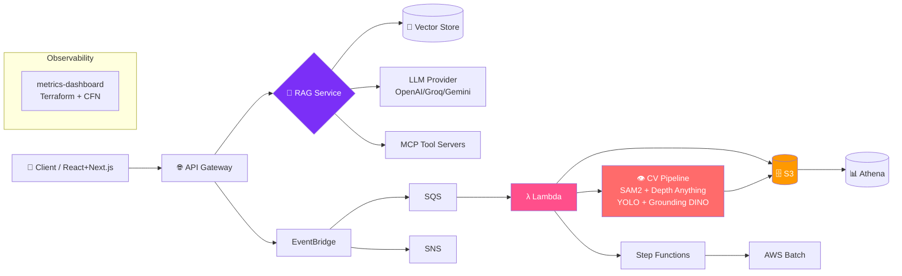
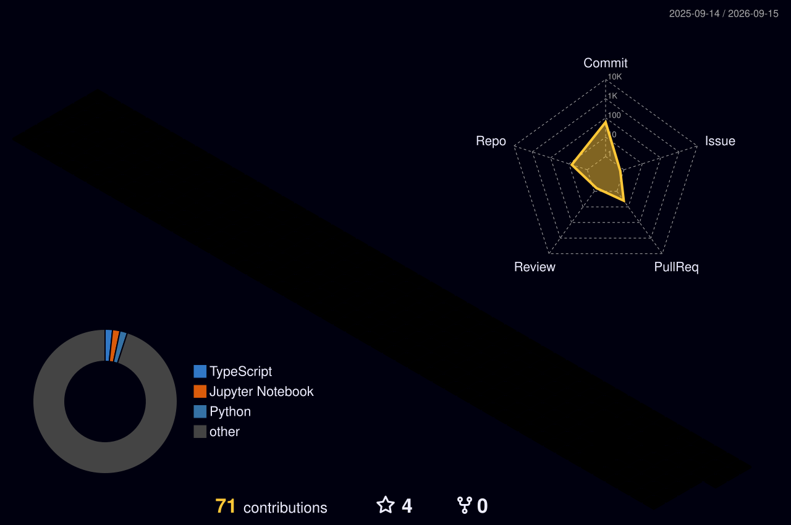

# 👋 Hi, I'm Hamza

<p align="center">
  
</p>

<p align="center">
  <a href="https://github.com/hamza-0987?tab=followers">
    
  </a>
  <a href="https://github.com/hamza-0987?tab=repositories">
    
  </a>
  <a href="https://github.com/hamza-0987">
    
  </a>
  <a href="https://visitorbadge.io/status?path=https%3A%2F%2Fgithub.com%2Fhamza-0987">
    
  </a>
</p>

<p align="center">
  
</p>

## 🧭 About Me

```yaml
role: "AI & MLOps Engineer | Cloud Infrastructure Engineer | Computer Vision Engineer"
focus: ["LLM Agents", "RAG Pipelines", "MLOps", "AWS Cloud", "Computer Vision"]
primary_language: Python
secondary_languages: ["JavaScript", "TypeScript", "SQL", "Bash"]
cloud: ["AWS", "Azure", "GCP"]
current: "Building production AI agents, RAG-as-a-Service & end-to-end ML systems"
achievements: ["Techathon Data Wrangling Winner", "Dean's List", "Google ML & Cloud Certs"]
```


</p>
<p align="center">
  
</p>

## 📊 GitHub Stats

<p align="center">

  
</p>

<p align="center">

  
</p>

<details>
<summary>📈 Language Distribution (by bytes — real data)</summary>

| Language | Size | Usage |
|---|---|---|
| 🐍 Python | **11.39 MB** | AI/ML, backend, cloud automation |
| 📓 Jupyter Notebook | **16.11 MB** | ML experiments & research |
| 🌐 JavaScript | **6.7 MB** | React / Node frontends |
| 🔷 TypeScript | **2.5 MB** | Typed frontend tooling |
| Others | — | C#, Java, C, HTML, CSS, SCSS, Shell, Dockerfile, Bicep, HCL, T-SQL |

</details>

<p align="center">
  
</p>

## 🚀 Featured Projects

<table>
  <tr>
    <td width="50%" align="center">
      <h3>🦅 <a href="https://github.com/hamza-0987/shaheenai">shaheenai</a></h3>
      <p><b>Multi-LLM Agent Library</b> — plug-in provider architecture (OpenAI / Anthropic / Ollama / Cohere) with self-reflection, tool invocation & task chaining.</p>
      
      
    </td>
    <td width="50%" align="center">
      <h3>📚 <a href="https://github.com/hamza-0987/RAG-AS-A-SERVICE">RAG-AS-A-SERVICE</a></h3>
      <p><b>Retrieval-Augmented Generation API</b> — production-ready endpoints powering groq-rag, text2sql & semantic search backends.</p>
      
      
    </td>
  </tr>
  <tr>
    <td width="50%" align="center">
      <h3>🌳 crown-tree-segmentation</h3>
      <p><b>SAM2 + Depth Anything</b> for crown/tree segmentation on drone imagery. Geospatial & agricultural CV pipeline.</p>
      
      
    </td>
    <td width="50%" align="center">
      <h3>🌾 <a href="https://github.com/hamza-0987">GPS-Acre</a></h3>
      <p><b>End-to-end agri-analytics platform</b> — EventBridge + SQS + Step Functions + Athena + S3. Plant counting & canola pipeline.</p>
      
    </td>
  </tr>
  <tr>
    <td width="50%" align="center">
      <h3>📡 metrics-dashboard</h3>
      <p><b>Cloud observability platform</b> — Terraform + CloudFormation + Serverless Framework. Cost/health monitoring & traceability.</p>
      
      
    </td>
    <td width="50%" align="center">
      <h3>🤖 <a href="https://github.com/hamza-0987/openai-agent-sdk">openai-agent-sdk</a></h3>
      <p><b>Agent SDK workbench</b> — news summarization agents, extensible tools, MCP connectivity.</p>
      
      
    </td>
  </tr>
</table>

<details>
<summary>📂 Full Project Index (44+ repos)</summary>

| Domain | Repositories |
|---|---|
| **AI Agents / LLM** | shaheenai, openai-agent-sdk, multi-agent-system, shaheen-jarvis, jarvis, gemini-chatbot-flask, terminal_ai_groq, groq-rag, groq-gradio, groq-autogen-studio-config |
| **RAG / MCP** | RAG-AS-A-SERVICE, easy-rag, neo4j-rag-example, text2sql, mcp, mcptest2, lenai |
| **Computer Vision** | crown-tree-segmentation-*, gemini-based-computer-vision-segmentation, dots.-ocr, supervision-experiments, AIProject-BridgeSign, plant-count-classifier, Eye-Disease-Classification, shape-identifier |
| **ML / Health / Finance** | Lung_Cancer_ML, diabetes-prediction-model, ML_Heart_Health_Prediction, stocksage, Malware-Detection-Using-API-Calls, scam_detector_ml, ml-performance-diagnosis-assistant |
| **Cloud / Data** | GPS-Acre, AWS-Batch-GPS-Acre, spotify-ETL-pipeline-*, metrics-dashboard, advance-data-manager, floci-local-aws-setup, farmevo-datamanager |
| **Frontend** | portfolio_hamza0987, OptiRecruit, IntelliHire, Trendzz, Ecommerce-Store, shaheenviz, schema-viewer, Online-Books-Library |
| **AgriCV** | canola_pipeline, gps_acre_latest, plant count classifier |

</details>
<p align="center">
  
</p>

## 🧠 Skill Matrix

### ☁️ Cloud & Infrastructure

| Skill | Level | Evidence |
|---|---|---|
| AWS Compute (EC2 / Lambda / Batch) |  | AWS-Batch-GPS-Acre, spotify-ETL-pipeline-* |
| AWS Messaging (EventBridge / SQS / SNS) |  | GPS-Acre, spotify-ETL-pipeline-* |
| AWS Storage (S3) |  | GPS-Acre, spotify-ETL-pipeline-* |
| AWS Analytics (Athena) |  | metrics-dashboard, GPS-Acre |
| AWS Step Functions |  | GPS-Acre, AWS-Batch-GPS-Acre |
| AWS IAM & Security |  | metrics-dashboard, GPS-Acre |
| Terraform |  | metrics-dashboard, advance-data-manager |
| CloudFormation |  | metrics-dashboard, AWS-Batch-GPS-Acre |
| Serverless Framework |  | metrics-dashboard, spotify-ETL-pipeline-* |
| Azure Functions & Blob |  | advance-data-manager |
| GCP Service Accounts |  | advance-data-manager |
| Docker & CI/CD |  | GPS-Acre, canola_pipeline, BahriaAI |

### 🤖 AI / MLOps

| Skill | Level | Evidence |
|---|---|---|
| Multi-LLM Agent Library |  | shaheenai |
| OpenAI Agent SDK |  | openai-agent-sdk |
| RAG as a Service |  | RAG-AS-A-SERVICE, groq-rag, text2sql |
| Groq / Gemini Integration |  | terminal_ai_groq, groq-gradio, gemini-chatbot-flask |
| Autogen / Multi-Agent |  | multi-agent-system, groq-autogen-studio-config |
| MCP Servers |  | mcp, mcptest2, lenai |
| ML Performance Diagnosis |  | ml-performance-diagnosis-assistant |
| Classification / Regression |  | Lung_Cancer_ML, diabetes-prediction-model, stocksage |

### 👁️ Computer Vision

| Skill | Level | Evidence |
|---|---|---|
| SAM2 + Depth Anything |  | crown-tree-segmentation-*, supervision-experiments |
| Semantic Segmentation |  | gemini-based-computer-vision-segmentation |
| Grounding DINO / YOLO |  | gps_acre_latest, canola_pipeline, Eye-Disease-Classification |
| SAM / Mobile SAM |  | AIProject-BridgeSign |
| OCR Pipelines |  | dots.-ocr |
| OpenCV / Super-Res / GAN |  | Multiple CV repos |
| Agricultural Analytics |  | canola_pipeline, gps_acre_latest |

### 💻 Languages & Frameworks

| Language | Level | Primary Use |
|---|---|---|
|  | Advanced | AI/ML, backend, cloud automation |
|  | Advanced | Research & experimentation |
|  | Advanced | React / Node frontends |
|  | Intermediate | Typed tooling |
|  | Advanced | text2sql, Hasura stack |
|  | Advanced | API data layer |
| SQL | Advanced | text2sql, streamlit_data_wrangling |
| Bash / Shell | Intermediate | Automation & infra scripting |
| Java / C / C# / Kotlin | Intermediate → Basic | Academic & systems work |

<p align="center">
  
</p>

## 🛠️ Tech Stack

<p align="center">
  
  
  
  
  
  
  
  
  
  <br/>
  
  
  
  
  
  
  
  
  <br/>
  
  
  
  
  
  
  
  
  
  
</p>

<p align="center">
  
</p>

🏆 Achievements & Certifications
<table>
<tr>
<td width="33%" align="center">
<br/>
<b>Techathon 1.0 Winner</b><br/>
<sub>Data Wrangling Track</sub>
</td>
<td width="33%" align="center">
<br/>
<b>Bahria University Karachi</b><br/>
<sub>Academic Recognition</sub>
</td>
<td width="33%" align="center">
<br/>
<b>Techathon 1.0 @ BUDS</b><br/>
<sub>Founder & Organizer</sub>
</td>
</tr>
</table>

<p align="center">
  
</p>

🎓 Education & Leadership
<table>
<tr>
<td width="50%">
<h3>🏛️ Bahria University, Karachi Campus</h3>
<p><b>Academic Recognition:</b> Dean's List</p>
<p><b>Focus:</b> Computer Science & Artificial Intelligence</p>
</td>
<td width="50%">
<h3>🎤 Technical Guest Speaker</h3>
<p>Delivered technical sessions on <b>Agentic AI, RAG, and Prompt Engineering</b> at university level, bridging the gap between academic theory and industry-grade MLOps.</p>
</td>
</tr>
<tr>
<td width="50%">
<h3>👑 Head of BUDS</h3>
<p><b>Bahria University Developer Society (BUDS)</b></p>
<p>Led the premier tech society, fostering a community of developers, organizing tech-talks, and mentoring peers in modern software development.</p>
</td>
<td width="50%">
<h3>🚀 Pioneer of Techathon 1.0</h3>
<p>Founded and organized <b>Techathon 1.0</b> at BUDS. Designed the data wrangling tracks and technical infrastructure for the event.</p>
</td>
</tr>
</table>


## 🏗️ System Architecture

<details>
<summary>🔧 Typical End-to-End AI/Cloud Pipeline (click to expand)</summary>



</details>

<p align="center">
  
</p>

## 📈 Contribution Graph

<p align="center">
  
</p>

<p align="center">
  <picture>
    <source media="(prefers-color-scheme: dark)" srcset="https://raw.githubusercontent.com/hamza-0987/hamza-0987/output/github-contribution-grid-snake-dark.svg" />
    <source media="(prefers-color-scheme: light)" srcset="https://raw.githubusercontent.com/hamza-0987/hamza-0987/output/github-contribution-grid-snake.svg" />
    
  </picture>
</p>

<h3 align="center">🌃 Contribution Skyline</h3>
<p align="center">
  
</p>

<h3 align="center">📊 Live Developer Metrics</h3>
<p align="center">
  
</p>

<p align="center">
  
</p>

## 📬 Let's Connect

<p align="center">
  <a href="https://github.com/hamza-0987">
    
  </a>
  <a href="https://www.linkedin.com/in/hamza-0987">
    
  </a>
  <a href="mailto:hamza@example.com">
    
  </a>
  <a href="https://huggingface.co/hamza-0987">
    
  </a>
</p>

<p align="center">
  
</p>

📜 Professional Certifications
<p align="center">


</p>


Credentials spanning Machine Learning, Generative AI, and Cloud Infrastructure.

<p align="center">
  
</p>

<p align="center">
  <i>⭐️ From <a href="https://github.com/hamza-0987">hamza-0987</a> — building AI systems that ship. ⭐️</i>
</p>


<p align="center">
  
  
</p>


